# Multimodal RAG Research Assistant

Local-first, document-grounded research system for PDF corpora. It ingests research documents asynchronously, preserves page-level evidence for text, tables, figures, and mathematical regions, and answers only from retrieved evidence with verifiable source citations.

The current deployment target is a single-node Docker Compose stack. Retrieval, reranking, evaluation, source verification, and optional local Ollama synthesis are implemented. Distributed vector storage, GPU telemetry, and inference acceleration are documented as scale-out work rather than represented as shipped features.

## System architecture

```mermaid
flowchart LR
    Browser[Next.js browser client] -->|PDF upload / query| API[FastAPI]
    API --> Jobs[Bounded ingestion worker]
    Jobs --> Extract[PyMuPDF layout extraction]
    Extract --> Evidence[Text, tables, figures, equations\npage + region metadata]
    Evidence --> Embed[SentenceTransformers\nall-MiniLM-L6-v2]
    Evidence --> BM25[In-process BM25]
    Embed --> FAISS[FAISS IndexFlatIP]
    FAISS --> Store[(Local artifacts\nPDFs + FAISS + JSONL + job state)]

    API --> QueryEmbed[Query embedding]
    QueryEmbed --> FAISS
    API --> QueryTerms[Normalized lexical query]
    QueryTerms --> BM25
    FAISS --> Dense[Dense candidates]
    BM25 --> Sparse[Sparse candidates]
    Dense --> RRF[Reciprocal rank fusion]
    Sparse --> RRF
    RRF --> Rerank[Cross-encoder reranker\nms-marco-MiniLM-L-6-v2]
    Rerank --> Guard[Evidence gate + citation validation]
    Guard --> Deterministic[Deterministic grounded answer]
    Guard --> Ollama[Optional local Ollama synthesis]
    Ollama --> CitationCheck[Citation validator]
    CitationCheck --> Response[Cited response + source cards\npage/region preview]
    Deterministic --> Response
    Response --> Browser
```



### Query dataflow

1. The API accepts a bounded query, selected document scope, and short session history.
2. Dense FAISS inner-product search and sparse BM25 search retrieve independent candidate sets from the same page-aware chunk corpus.
3. Reciprocal rank fusion combines rank positions rather than incompatible raw scores.
4. A cross-encoder reranks fused candidates and a bounded dense-recall backfill.
5. The evidence gate verifies query support, document scope, and requested comparison coverage. Weak evidence yields an explicit unsupported response.
6. The deterministic answer builder produces cited claims. Optional Ollama synthesis is permitted only over selected evidence and is rejected if its citations cannot be validated.
7. The client renders document/page citations, source-region cards, and locally rendered PDF previews.

## Key technical features

| Capability | Implementation |
| --- | --- |
| Multi-document ingestion | Background PDF jobs with `queued`, `extracting`, `embedding`, `indexed`, `failed`, and `cancelled` states. |
| Layout-aware parsing | PyMuPDF and Pillow extract text, tables, figures, source regions, pages, sections, and extraction-quality metadata. Optional Pix2Tex assists math-region handling; the original source crop remains authoritative. |
| Hybrid retrieval | Normalized `all-MiniLM-L6-v2` dense embeddings in FAISS plus in-process BM25, fused with reciprocal rank fusion. |
| Precision stage | Batched `ms-marco-MiniLM-L-6-v2` cross-encoder reranking; runtime may also load a local fine-tuned checkpoint. |
| Grounded generation | Deterministic source-backed claims, document/page citations, citation validation, and an unsupported-answer fallback. |
| Multimodal evidence | Text, table, figure-caption, and equation evidence are preserved as typed chunks with page and region metadata. |
| Source verification | Citation cards link to locally rendered cited pages or evidence regions; original PDFs remain accessible through the API. |
| Comparison retrieval | Explicit document scopes, source-aware diversification, and per-aspect evidence allocation for multi-document questions. |
| Conversation continuity | Bounded session history supports follow-up questions while every response performs fresh retrieval. |
| Evaluation | Source-page Recall@K, MRR, nDCG@K, citation provenance, answer-faithfulness review, latency capture, and retrieval configuration comparison. |

## Measured retrieval performance

Evaluation uses 66 manually labeled questions across six PDFs: NIST AI risk guidance, *Attention Is All You Need*, IPCC AR6 Synthesis Report, U.S. Census poverty data, a USGS remote-sensing report, and OpenStax *Calculus Volume 3*. Labels are evaluated at source-page granularity, which matches the citation and source-preview contract.

| Retrieval configuration | Recall@1 | Recall@3 | Recall@5 | MRR | nDCG@5 |
| --- | ---: | ---: | ---: | ---: | ---: |
| Dense FAISS | 0.206 | 0.430 | 0.565 | 0.490 | 0.438 |
| Dense FAISS + cross-encoder | **0.419** | 0.694 | 0.766 | **0.733** | 0.697 |
| BM25 + FAISS with RRF | 0.214 | 0.441 | 0.624 | 0.510 | 0.478 |
| BM25 + FAISS + cross-encoder | 0.393 | **0.703** | **0.831** | 0.725 | **0.716** |

Hybrid retrieval plus reranking improves Recall@5 by **26.6 percentage points** over dense-only retrieval in the published evaluation. Dense reranking has the highest measured MRR; the README reports this trade-off rather than claiming that one configuration wins every metric.

| Operational measure | Current status |
| --- | --- |
| Vector-index p95 latency | Not published; the local FAISS process has no Prometheus/Grafana latency instrumentation. |
| Ingestion pages/second | Not published; speed depends on page layout, OCR use, embedding hardware, and document size. |
| Reranking overhead | Captured per query in evaluation artifacts, but no universal target is claimed. |
| GPU utilization / p99 latency | Not implemented; no GPU telemetry or metrics backend is included. |

Run the evaluation against an indexed corpus:

```powershell
$env:PYTHONPATH = "$PWD\src"
.\.venv\Scripts\python.exe scripts\run_evaluation.py
```

## Technology stack

| Layer | Components | Responsibility |
| --- | --- | --- |
| Client | Next.js 16, React 19, TypeScript, Tailwind CSS, KaTeX | Uploads, query workflow, evaluation view, citations, page previews, safe math display. |
| API | FastAPI, Pydantic, Uvicorn, CORS middleware | Validated HTTP contract, ingestion jobs, document lifecycle, health/readiness endpoints. |
| Extraction | PyMuPDF, Pillow | PDF text/layout extraction, table/figure evidence, region rendering. |
| Math verification | PyMuPDF regions, optional Pix2Tex | Equation-region detection with source-first verification. |
| Embeddings | PyTorch, SentenceTransformers `all-MiniLM-L6-v2` | Normalized dense query and document vectors. |
| Reranking | Transformers, `cross-encoder/ms-marco-MiniLM-L-6-v2` | Cross-encoder relevance ordering and local checkpoint support. |
| Retrieval storage | FAISS `IndexFlatIP`, local BM25, JSONL/JSON manifests, local PDFs | Persistent, in-process hybrid search for a single-node deployment. |
| Delivery | Docker Compose, GitHub Actions, pytest, ESLint, CodeQL | Local reproducibility, test/build verification, dependency and source scanning. |

## Quickstart: Docker Compose

### Prerequisites

- Docker Desktop with Docker Compose V2.
- Internet access for the first model-cache initialization, or a pre-populated `artifacts/model-cache` volume.

### Start the stack

```powershell
git clone <your-repository-url>
cd rag-research-assistant
docker compose -f docker/docker-compose.yml up --build
```

| Service | URL |
| --- | --- |
| Web client | `http://localhost:3000` |
| OpenAPI documentation | `http://localhost:8000/docs` |
| Backend liveness | `http://localhost:8000/health` |
| Backend readiness | `http://localhost:8000/ready` |

The Compose configuration binds services to `127.0.0.1`, runs containers as non-root users, drops Linux capabilities, sets memory/CPU limits, uses `no-new-privileges`, and persists the corpus and model cache beneath `artifacts/`.

Upload PDFs through the UI or `POST /upload`; do not copy source files directly into `artifacts/uploads`, because that bypasses metadata and index updates.

### Optional local Ollama synthesis

The deterministic cited-answer path is always available. Ollama is optional and disabled by default.

```powershell
winget install Ollama.Ollama
ollama pull qwen2.5:7b-instruct

$env:ANSWER_SYNTHESIS_ENABLED = "true"
$env:OLLAMA_MODEL = "qwen2.5:7b-instruct"
docker compose -f docker/docker-compose.yml up --build
```

Ollama runs on the local host; Compose accesses it through `host.docker.internal`. If the provider is unavailable, slow, or returns invalid citations, the service falls back to the deterministic response. Remote synthesis is denied unless `ALLOW_REMOTE_SYNTHESIS=true` is explicitly configured.

## API usage

Upload a PDF:

```powershell
curl.exe -X POST "http://localhost:8000/upload" `
  -F "files=@C:/absolute/path/to/document.pdf;type=application/pdf"
```

Poll ingestion state:

```powershell
Invoke-RestMethod "http://localhost:8000/documents"
```

Query the indexed corpus:

```powershell
curl.exe -X POST "http://localhost:8000/query" `
  -H "Content-Type: application/json" `
  -d '{"query":"What does the report conclude about climate-resilient development?","top_k":5,"session_id":"demo"}'
```

```json
{
  "answer": "... [IPCC_AR6_SYR_FullVolume.pdf, p. 40]",
  "answer_intent": "explanation",
  "unsupported": false,
  "confidence": 0.73,
  "sources": [{
    "chunk_id": "IPCC_AR6_SYR_FullVolume.pdf-40-text-2-0",
    "source": "IPCC_AR6_SYR_FullVolume.pdf",
    "page": 40,
    "type": "text",
    "text": "..."
  }],
  "synthesis_mode": "deterministic",
  "latency_ms": 0.0,
  "session_id": "demo"
}
```

| Method | Endpoint | Function |
| --- | --- | --- |
| `GET` | `/health` | Process liveness probe. |
| `GET` | `/ready` | Model/index readiness probe. |
| `POST` | `/upload` | Persist and enqueue PDF ingestion. |
| `GET` | `/documents` | List persisted document and job state. |
| `GET` | `/jobs/{job_id}` | Retrieve job progress. |
| `POST` | `/query` | Retrieve and answer from evidence. |
| `POST` | `/session/{session_id}/query` | Query with bounded conversation continuity. |
| `GET` | `/documents/{filename}/page-preview` | Render a cited page or source region. |
| `DELETE` | `/documents/{filename}` | Remove a managed document and its chunks. |
| `GET` | `/metrics` | Read the persisted evaluation summary. |

## System governance and reliability

### Evidence controls

- Answers are constrained to reranked evidence records, with document/page citations on substantive claims.
- Weak retrieval returns an explicit unsupported answer instead of speculative content.
- Multi-document comparisons enforce selected source coverage before a response is accepted.
- Optional synthesis receives only selected evidence, treats it as untrusted content, requires exact citations, and is rejected on validation failure.
- Mathematics is source-verified: original PDF regions are preferred when extracted notation is unreliable.

### Input, data, and lifecycle controls

- Upload validation enforces PDF signatures, encryption checks, filename safety, duplicate handling, page dimensions, and bounded file/page/request sizes.
- Query validation bounds query length, `top_k`, document names, history length, and upload count before retrieval work begins.
- Structured identifier parsing uses literal, linear parsing rather than query-derived regular expressions.
- Managed deletion removes the PDF, metadata, and indexed chunks together; persisted index publication uses temporary files, validation, rollback snapshots, and interrupted-transaction recovery.
- Uploaded documents, FAISS data, JSONL metadata, job state, and cached models stay in the local `artifacts/` directory.

### Service reliability and security

- Ingestion uses a bounded executor to avoid competing large-PDF workloads.
- Embedding and reranking inference are protected by a bounded concurrency gate; cross-encoder inference uses batches and `torch.inference_mode()`.
- Session history and completed-job references are bounded to prevent unbounded in-memory growth.
- Docker containers run with dropped capabilities, `no-new-privileges`, temporary filesystem limits, explicit resource caps, and loopback-only port bindings.
- Optional API-key authentication is available through `RAG_API_KEY` for direct API use. The browser UI is intended for localhost operation; public deployment should place it behind an authenticated reverse proxy.
- GitHub Actions executes backend tests, frontend lint/build, Docker image/config validation, dependency auditing, and CodeQL analysis. The protected `main` branch requires CI checks and blocks force pushes.

Run the local validation suite:

```powershell
$env:PYTHONPATH = "$PWD\src"
.\.venv\Scripts\python.exe -m pytest -q -p no:cacheprovider
.\.venv\Scripts\python.exe -m bandit -q -r src -ll

Set-Location frontend
npm run lint
npm run build
```

## Fine-tuned reranker workflow

Train a local binary relevance checkpoint from JSON or JSONL records containing `query`, `passage`, and a `label` of `0` or `1`:

```powershell
$env:PYTHONPATH = "$PWD\src"
.\.venv\Scripts\python.exe -m multimodal_rag.train_reranker `
  --data-path local_data\reranker_training.jsonl `
  --output-dir artifacts\reranker
```

Evaluate it against the pinned pretrained baseline using identical source-page labels and candidate pools:

```powershell
$env:PYTHONPATH = "$PWD\src"
.\.venv\Scripts\python.exe scripts\run_evaluation.py `
  --reranker-model artifacts\reranker `
  --reranker-revision "" `
  --compare-reranker-model cross-encoder/ms-marco-MiniLM-L-6-v2 `
  --compare-reranker-revision 233902d25c440f23af6f7d6e94d2946bac0bee0a `
  --output-dir results\reranker-comparison
```

## Repository layout

```text
.
├── src/multimodal_rag/       # API, extraction, retrieval, reranking, schemas
├── frontend/                 # Next.js client
├── docker/                   # Container definitions and Compose stack
├── evaluation/               # Questions, labels, rubric, published metrics
├── scripts/                  # Evaluation and operational utilities
├── tests/                    # API, retrieval, persistence, and regression tests
├── artifacts/                # Runtime-only PDFs, indexes, metadata, job state
└── .github/workflows/        # CI and CodeQL workflows
```

## Scale-out roadmap

The following are intentional future extensions, not current repository claims:

| Area | Planned change |
| --- | --- |
| Parsing | Add PyTesseract, pdfplumber, and OpenCV where they demonstrably improve scanned-page OCR, complex-table extraction, or figure analysis over the PyMuPDF baseline. |
| Embeddings | Benchmark CLIP or SigLIP-style multimodal encoders against the current text/metadata representation. |
| Vector platform | Replace the local FAISS process with Qdrant or Milvus when tenant isolation, replication, payload filtering at scale, or horizontal capacity is required. |
| Serving | Export measured model paths to ONNX Runtime or TensorRT only after hardware-specific correctness and latency evaluation. |
| Observability | Add Prometheus metrics and Grafana dashboards for queue depth, error rates, GPU utilization, and p50/p95/p99 end-to-end latency. |
| Retrieval | Add parent-child/hierarchical chunking and payload-level filters, then evaluate against the existing source-page benchmark. |

No target such as 38 ms p95 vector search, 620 pages/second ingestion, 0.91 Recall@5, or sub-12 ms reranking is presented as a measured result until the corresponding implementation and reproducible benchmark exist.
