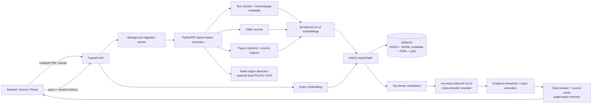

# Multimodal RAG Research Assistant

Document-grounded research assistant for local PDF corpora. The system performs background ingestion, layout-aware extraction, dense FAISS retrieval, cross-encoder reranking, evidence-constrained synthesis, page-level citations, and source-region verification for tables, figures, and mathematical notation.

The current implementation is a single-user, local-first prototype with reproducible retrieval evaluation. It is intentionally explicit about the boundary between implemented behavior and production roadmap items.

## Architecture



### Retrieval path

1. A PDF is persisted, queued, extracted, chunked, embedded, and added to the persistent FAISS index by one background worker.
2. A query is encoded using `sentence-transformers/all-MiniLM-L6-v2`.
3. FAISS inner-product search returns a dense candidate pool (default: 30 chunks).
4. `cross-encoder/ms-marco-MiniLM-L-6-v2` reranks the candidate pool (default: 12 candidates, batched).
5. The answer builder selects readable, evidence-backed claims; every substantive claim is associated with a document and page citation.
6. When evidence is weak, the system returns an explicit unsupported-answer fallback rather than synthesizing an ungrounded response.

## Key technical features

- **Asynchronous ingestion:** PDF uploads return after persistence; a background job reports `queued`, `extracting`, `embedding`, `indexed`, `failed`, or `cancelled` state.
- **Persistent local corpus:** Uploaded PDFs, FAISS index, JSONL chunk metadata, document manifest, and job state are stored under `artifacts/` and restored after restart.
- **Layout-aware evidence:** Text, tables, figures, section labels, pages, bounding boxes, extraction-quality flags, and equation regions remain associated with their source page.
- **Two-stage neural retrieval:** Dense semantic retrieval followed by a local transformer cross-encoder reranker.
- **Intent-aware synthesis:** Definitions, explanations, procedures, comparisons, document summaries, and visual questions receive evidence-specific response structures.
- **Summary controls:** Document summaries filter navigation, reference, URL, and boilerplate content; evidence is diversified across substantive sections and pages.
- **Mathematics accuracy controls:** Equations are treated as source-verification artifacts. When extracted notation is unreliable, the interface renders the original PDF crop rather than inventing LaTeX.
- **Citation and source viewer:** Source cards expose document, page, typed evidence, PDF-page preview, and original-file access.
- **Conversation continuity:** Short, bounded session history supports follow-up queries while each response still performs fresh retrieval.
- **API validation:** Pydantic constrains query length, history length, document names, top-k, file count, and upload size.
- **Local model policy:** Hugging Face models default to `MODEL_LOCAL_FILES_ONLY=true`; uploads do not trigger model downloads.

## Evaluation and benchmark results

The checked-in benchmark contains **66 manually labelled questions** over six indexed PDFs:

- NIST AI risk-management guidance
- *Attention Is All You Need*
- IPCC AR6 Synthesis Report
- U.S. Census *Poverty in the United States: 2024*
- USGS remote-sensing report
- OpenStax *Calculus Volume 3*

It includes definitions, procedures, summaries, tables, figures, mathematical concepts, multi-document comparisons, and four deliberate unsupported questions. Ground-truth relevance labels use persisted chunk IDs and source pages.

| Retrieval configuration | Recall@1 | Recall@3 | Recall@5 | MRR | nDCG@5 |
| --- | ---: | ---: | ---: | ---: | ---: |
| Dense FAISS | 0.165 | 0.324 | 0.405 | 0.425 | 0.320 |
| Dense FAISS + cross-encoder reranker | 0.426 | 0.534 | 0.574 | 0.688 | 0.555 |

The cross-encoder improves Recall@5 by **16.9 percentage points** and MRR by **0.263** on the current corpus. The evaluation also identifies remaining weaknesses: large mathematical corpora and multi-document comparison require source-aware candidate selection and cross-source diversification. The scores are intentionally reported as measured prototype results, not inflated production claims.

Run the benchmark locally after indexing the evaluation corpus:

```powershell
$env:PYTHONPATH = "$PWD\src"
.\.venv\Scripts\python.exe scripts\run_evaluation.py
```

Outputs:

```text
evaluation/questions.json
evaluation/ground_truth.json
evaluation/rubric.md
evaluation/predictions/baseline.json
evaluation/predictions/reranked.json
evaluation/predictions/metrics.json
```

## Technology stack

| Layer | Implemented components | Responsibility |
| --- | --- | --- |
| Frontend | Next.js 16, React 19, TypeScript, Tailwind CSS, KaTeX | Upload workflow, job status, query UI, citations, PDF previews, safe math display |
| API | FastAPI, Pydantic, Uvicorn, CORS middleware | HTTP contract, request validation, job and document endpoints |
| Parsing | PyMuPDF, Pillow | Layout-aware PDF text, table/figure records, page and region rendering |
| Math verification | PyMuPDF region detection, optional Pix2Tex | Local equation-region handling with source-first verification |
| Embeddings | PyTorch, SentenceTransformers `all-MiniLM-L6-v2` | Normalized dense document and query embeddings |
| Reranking | Hugging Face Transformers, `ms-marco-MiniLM-L6-v2` | Cross-encoder relevance ordering |
| Index and storage | FAISS `IndexFlatIP`, JSONL, JSON manifests, local PDF files | In-process dense search and persistent single-node artifacts |
| Delivery | Docker Compose, GitHub Actions, pytest, ESLint | Reproducible local runtime, validation, container build checks |

## Quickstart: Docker Compose

### Prerequisites

- Docker Desktop with Compose V2
- Cached local model artifacts when operating offline. The backend defaults to local-only Hugging Face model loading.

### Start the stack

```powershell
git clone <your-repository-url>
cd RAG
docker compose -f docker/docker-compose.yml up --build
```

Services:

- Frontend: `http://localhost:3000`
- FastAPI documentation: `http://localhost:8000/docs`
- Backend health: `http://localhost:8000/health`

The Compose volume persists backend state in `artifacts/`. Do not copy PDFs directly into `artifacts/uploads`; upload them through the UI or API so that indexing metadata remains consistent.

### Local development without Docker

Backend:

```powershell
cd "C:\Users\Uploa\Documents\RAG"
.\.venv\Scripts\Activate.ps1
$env:PYTHONPATH = "$PWD\src"
.\.venv\Scripts\python.exe -m uvicorn multimodal_rag.api:app --host 127.0.0.1 --port 8000
```

Frontend:

```powershell
cd "C:\Users\Uploa\Documents\RAG\frontend"
npm run dev
```

The first upload or query initializes the embedding and reranking models. `/health` remains lightweight and should respond immediately after Uvicorn starts.

## API usage

Upload one or more PDFs:

```powershell
curl.exe -X POST "http://localhost:8000/upload" `
  -F "files=@C:/absolute/path/to/document.pdf;type=application/pdf"
```

Poll the document list until a job reaches `indexed`:

```powershell
Invoke-RestMethod "http://localhost:8000/documents"
```

Query the corpus:

```powershell
curl.exe -X POST "http://localhost:8000/query" `
  -H "Content-Type: application/json" `
  -d '{"query":"What does the report conclude about climate-resilient development?","top_k":5,"session_id":"demo"}'
```

Representative response shape:

```json
{
  "answer": "... [IPCC_AR6_SYR_FullVolume.pdf, p. 40]",
  "answer_intent": "explanation",
  "unsupported": false,
  "confidence": 0.73,
  "sources": [
    {
      "chunk_id": "IPCC_AR6_SYR_FullVolume.pdf-40-text-2-0",
      "source": "IPCC_AR6_SYR_FullVolume.pdf",
      "page": 40,
      "type": "text",
      "text": "..."
    }
  ],
  "latency_ms": 0.0,
  "session_id": "demo"
}
```

Key endpoints:

| Method | Endpoint | Purpose |
| --- | --- | --- |
| `GET` | `/health` | Liveness probe |
| `POST` | `/upload` | Persist and queue PDF ingestion |
| `GET` | `/documents` | List persisted document state |
| `GET` | `/jobs/{job_id}` | Read ingestion progress |
| `POST` | `/query` | Retrieve and answer from evidence |
| `GET` | `/documents/{filename}/page-preview` | Render a cited page or source region |
| `DELETE` | `/documents/{filename}` | Remove a document and its indexed chunks |
| `GET` | `/math/status` | Inspect local math-OCR availability |

## System governance and reliability

### Evidence and hallucination controls

- Query answers are generated only from reranked evidence records.
- Substantive output claims retain document/page citations.
- The system applies a confidence gate; weak retrieval returns an explicit unsupported-answer response.
- Summary retrieval rejects table-of-contents pages, references, URL-heavy content, headers, and other boilerplate before synthesis.
- Mathematical OCR output is never treated as automatically authoritative. Original PDF regions remain the verification source.

### Data controls

- Upload limits: **100 MB per file**, **10 files per request**.
- Query validation: non-empty query, 2,000-character maximum, `top_k` constrained to 1–20, bounded session history.
- Local artifacts are persisted under `artifacts/`; source PDFs for evaluation can be kept in `local_data/`, which is ignored by Git.
- Document deletion removes managed files, metadata, and indexed chunks through the API rather than leaving orphaned state.

### Operational controls

- A Docker health check probes `/health`.
- Background ingestion uses a bounded executor (`ingestion_worker_count=1`) to avoid concurrent large-PDF contention.
- Reranker inference runs in batches (`reranker_batch_size=16`) with `torch.no_grad()` to constrain inference memory.
- Session history and completed job references are bounded to prevent unbounded in-process growth.
- GitHub Actions runs backend tests, frontend lint/build, backend/frontend image builds, and Compose configuration validation.

Run the complete validation suite:

```powershell
$env:PYTHONPATH = "$PWD\src"
.\.venv\Scripts\python.exe -m pytest -p no:cacheprovider

cd frontend
npm run lint
npm run build
```

## Production roadmap

The following are not current repository capabilities and should not be represented as benchmarked or deployed features:

- Hybrid dense + sparse retrieval using BM25.
- Multimodal CLIP or SigLIP embeddings.
- Qdrant or Milvus as a distributed vector database.
- PyTesseract, pdfplumber, or OpenCV ingestion stages.
- ONNX Runtime or TensorRT model acceleration.
- Prometheus/Grafana metrics, GPU telemetry, and p95/p99 latency SLO dashboards.
- Hierarchical parent-child chunk retrieval, tenant isolation, authentication, and distributed job execution.

The next retrieval milestone is source-aware candidate selection with per-document diversification, followed by hybrid lexical retrieval. Only after that work is implemented and measured should targets such as sub-40 ms p95 vector search, 0.91 Recall@5, or sub-12 ms reranking overhead be published as performance claims.

## Repository layout

```text
.
├── src/multimodal_rag/       # API, ingestion, retrieval, reranking, schemas
├── frontend/                 # Next.js client
├── docker/                   # Backend Dockerfile and Compose definition
├── evaluation/               # Questions, ground truth, rubric, predictions
├── scripts/                  # Evaluation and local setup utilities
├── tests/                    # API, retrieval, persistence, and regression tests
├── artifacts/                # Runtime-only PDFs, FAISS index, metadata, job state
└── .github/workflows/        # CI pipeline
```
