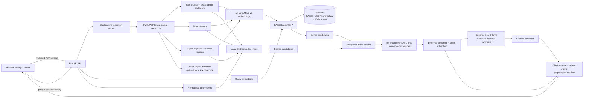

# Multimodal RAG Research Assistant

Document-grounded research assistant for local PDF corpora. The system performs background ingestion, layout-aware extraction, hybrid BM25 + dense FAISS retrieval, cross-encoder reranking, evidence-constrained synthesis, page-level citations, and source-region verification for tables, figures, and mathematical notation.

The current implementation is a single-user, local-first prototype with reproducible retrieval evaluation. It is intentionally explicit about the boundary between implemented behavior and production roadmap items.

## Architecture



### Retrieval path

1. A PDF is persisted, queued, extracted, chunked, embedded, and added to the persistent FAISS index by one background worker.
2. A query is encoded using `sentence-transformers/all-MiniLM-L6-v2`.
3. FAISS inner-product search and a local BM25 inverted index each return a candidate pool (default: 30 chunks); an explicit document scope is applied to both.
4. Reciprocal Rank Fusion merges dense and sparse rankings without comparing incompatible score scales.
5. `cross-encoder/ms-marco-MiniLM-L-6-v2` reranks fused candidates plus a bounded dense-recall backfill (default: 12 + up to 12 candidates, batched).
6. The deterministic answer builder selects readable, evidence-backed claims; every substantive claim is associated with a document and page citation.
7. When explicitly enabled, a local Ollama model rewrites only the selected evidence into intent-aware prose. The response is accepted only when every factual Markdown block uses an exact retrieved document/page citation; otherwise the deterministic answer is returned.
8. When evidence is weak, the system returns an explicit unsupported-answer fallback rather than synthesizing an ungrounded response.

## Key technical features

- **Asynchronous ingestion:** PDF uploads return after persistence; a background job reports `queued`, `extracting`, `embedding`, `indexed`, `failed`, or `cancelled` state.
- **Persistent local corpus:** Uploaded PDFs, FAISS index, JSONL chunk metadata, document manifest, and job state are stored under `artifacts/` and restored after restart.
- **Layout-aware evidence:** Text, tables, figures, section labels, pages, bounding boxes, extraction-quality flags, and equation regions remain associated with their source page.
- **Hybrid retrieval:** Dense FAISS semantic search and local BM25 lexical search fused with Reciprocal Rank Fusion, followed by transformer cross-encoder reranking.
- **Adaptable reranking:** The runtime can load either the pinned pretrained cross-encoder or a locally fine-tuned checkpoint, and the benchmark can compare both over identical retrieved candidate pools.
- **Source-aware comparisons:** Explicit document scopes are enforced before reranking; comparison questions allocate candidates to each requested document and diversify the final evidence by source and page.
- **Intent-aware synthesis:** Definitions, explanations, procedures, comparisons, document summaries, and visual questions receive evidence-specific response structures.
- **Optional local answer synthesis:** A local Ollama provider can transform selected evidence into concise, citation-required research prose. A citation validator and a short failure cooldown preserve deterministic retrieval behavior when the provider is unavailable or returns invalid output.
- **Summary controls:** Document summaries filter navigation, reference, URL, and boilerplate content; evidence is diversified across substantive sections and pages.
- **Mathematics accuracy controls:** Equations are treated as source-verification artifacts. When extracted notation is unreliable, the interface renders the original PDF crop rather than inventing LaTeX.
- **Citation and source viewer:** Source cards expose document, page, typed evidence, PDF-page preview, and original-file access.
- **Conversation continuity:** Short, bounded session history supports follow-up queries while each response still performs fresh retrieval.
- **API validation:** Pydantic constrains query length, history length, document names, top-k, file count, and upload size.
- **Local model policy:** Hugging Face models default to `MODEL_LOCAL_FILES_ONLY=true`; uploads do not trigger model downloads.
- **Local synthesis policy:** Ollama synthesis is disabled by default. It remains local when enabled and never broadens the answer beyond the supplied reranked passages.

## Evaluation and benchmark results

The checked-in benchmark contains **66 manually labelled questions** over six indexed PDFs:

- NIST AI risk-management guidance
- *Attention Is All You Need*
- IPCC AR6 Synthesis Report
- U.S. Census *Poverty in the United States: 2024*
- USGS remote-sensing report
- OpenStax *Calculus Volume 3*

It includes definitions, procedures, summaries, tables, figures, mathematical concepts, multi-document comparisons, and four deliberate unsupported questions. Ground-truth relevance labels use persisted chunk IDs and source pages.

| Retrieval configuration | Recall@1 | Recall@3 | Recall@5 | MRR | nDCG@5 |
| --- | ---: | ---: | ---: | ---: | ---: |
| Dense FAISS | 0.206 | 0.430 | 0.565 | 0.490 | 0.438 |
| Dense FAISS + cross-encoder reranker | **0.419** | 0.694 | 0.766 | **0.733** | 0.697 |
| Hybrid BM25 + FAISS (RRF) | 0.214 | 0.441 | 0.624 | 0.510 | 0.478 |
| Hybrid BM25 + FAISS + cross-encoder reranker | 0.393 | **0.703** | **0.831** | 0.725 | **0.716** |

Metrics are measured at **source-page** granularity: a different extracted chunk from a manually labeled source page is valid evidence for the same page-verification workflow. Strict chunk-identity diagnostics remain in the artifact to expose chunking sensitivity. Hybrid retrieval plus reranking reaches the release retrieval targets (Recall@5 >= 0.80 and MRR >= 0.70); its Recall@5 improves by **26.6 percentage points** over dense-only retrieval. Dense reranking has the higher MRR in this run, so the repository reports that trade-off rather than claiming a uniform hybrid win.

Run the benchmark locally after indexing the evaluation corpus:

```powershell
$env:PYTHONPATH = "$PWD\src"
.\.venv\Scripts\python.exe scripts\run_evaluation.py
```

### Fine-tuned reranker workflow

The repository includes a bounded local cross-encoder fine-tuning workflow for
binary query/passage relevance data. Supply JSON or JSONL records with
`query`, `passage`, and a `label` of `0` or `1`; the training command rejects
one-class datasets and writes a reproducibility manifest with the checkpoint.

```powershell
$env:PYTHONPATH = "$PWD\src"
.\.venv\Scripts\python.exe -m multimodal_rag.train_reranker `
  --data-path local_data\reranker_training.jsonl `
  --output-dir artifacts\reranker
```

Compare the local checkpoint with the pinned pretrained baseline against the
same corpus, candidate pools, and source-page labels. Keep comparison output
outside `evaluation/predictions/` unless you intend to replace the dashboard's
published default benchmark.

```powershell
$env:PYTHONPATH = "$PWD\src"
.\.venv\Scripts\python.exe scripts\run_evaluation.py `
  --reranker-model artifacts\reranker `
  --reranker-revision "" `
  --compare-reranker-model cross-encoder/ms-marco-MiniLM-L-6-v2 `
  --compare-reranker-revision 233902d25c440f23af6f7d6e94d2946bac0bee0a `
  --output-dir results\reranker-comparison
```

To serve the locally trained checkpoint, set `RERANKER_MODEL` to its directory
and set `RERANKER_REVISION` to an empty string before starting the backend. In
Docker Compose, the persisted artifacts directory is mounted at `/app/artifacts`,
so use `RERANKER_MODEL=/app/artifacts/reranker`. The evaluation dashboard shows
all measured retrieval configurations in the active metrics artifact.

Outputs:

```text
evaluation/questions.json
evaluation/ground_truth.json
evaluation/rubric.md
evaluation/predictions/baseline.json
evaluation/predictions/reranked.json
evaluation/predictions/hybrid.json
evaluation/predictions/hybrid_reranked.json
evaluation/predictions/metrics.json
evaluation/predictions/answers_deterministic.json
evaluation/predictions/answers_ollama.json
evaluation/predictions/answer_metrics.json
evaluation/predictions/answer_review_template.csv
evaluation/predictions/semantic_review.json
```

## Technology stack

| Layer | Implemented components | Responsibility |
| --- | --- | --- |
| Frontend | Next.js 16, React 19, TypeScript, Tailwind CSS, KaTeX | Upload workflow, job status, query UI, citations, PDF previews, safe math display |
| API | FastAPI, Pydantic, Uvicorn, CORS middleware | HTTP contract, request validation, job and document endpoints |
| Parsing | PyMuPDF, Pillow | Layout-aware PDF text, table/figure records, page and region rendering |
| Math verification | PyMuPDF region detection, optional Pix2Tex | Local equation-region handling with source-first verification |
| Embeddings | PyTorch, SentenceTransformers `all-MiniLM-L6-v2` | Normalized dense document and query embeddings |
| Reranking | Hugging Face Transformers, `ms-marco-MiniLM-L6-v2` | Cross-encoder relevance ordering |
| Index and storage | FAISS `IndexFlatIP`, local BM25 inverted index, JSONL, JSON manifests, local PDF files | Hybrid in-process search and persistent single-node artifacts |
| Delivery | Docker Compose, GitHub Actions, pytest, ESLint | Reproducible local runtime, validation, container build checks |

## Quickstart: Docker Compose

### Prerequisites

- Docker Desktop with Compose V2
- Internet access on the first Compose start, or an existing `artifacts/model-cache`. Compose downloads only the pinned model revisions and reuses the persisted cache afterward.

### Start the stack

```powershell
git clone <your-repository-url>
cd RAG
docker compose -f docker/docker-compose.yml up --build
```

Services:

- Frontend: `http://localhost:3000`
- FastAPI documentation: `http://localhost:8000/docs`
- Backend health: `http://localhost:8000/health`
- Backend readiness: `http://localhost:8000/ready`

Compose binds both ports to `127.0.0.1`, runs the services as non-root users, drops Linux capabilities, and applies CPU/memory limits. The Compose volume persists backend state in `artifacts/`. Do not copy PDFs directly into `artifacts/uploads`; upload them through the UI or API so that indexing metadata remains consistent.

### Local development without Docker

Use Python 3.11, matching CI and the backend container. The repository includes `.python-version` so compatible environment managers select the tested interpreter.

Backend:

```powershell
cd "C:\Users\Uploa\Documents\RAG"
.\.venv\Scripts\Activate.ps1
$env:PYTHONPATH = "$PWD\src"
.\.venv\Scripts\python.exe -m uvicorn multimodal_rag.api:app --host 127.0.0.1 --port 8000
```

Frontend:

```powershell
cd "C:\Users\Uploa\Documents\RAG\frontend"
npm run dev
```

The first upload or query initializes the embedding and reranking models. `/health` is a lightweight liveness probe; `/ready` verifies model and index availability.

For direct API or non-local deployment, set `RAG_API_KEY` before starting the backend and include it as either `X-API-Key` or a Bearer token. The default browser UI is intended for localhost operation; use an authenticated server-side proxy before exposing it publicly.

### Optional local answer synthesis

The deterministic, citation-backed answer builder is always available. To enable clearer research-style prose, install and run Ollama locally, then enable the provider before starting the backend:

```powershell
winget install Ollama.Ollama
ollama pull qwen2.5:7b-instruct

$env:ANSWER_SYNTHESIS_ENABLED = "true"
$env:OLLAMA_MODEL = "qwen2.5:7b-instruct"
$env:PYTHONPATH = "$PWD\src"
.\.venv\Scripts\python.exe -m uvicorn multimodal_rag.api:app --host 127.0.0.1 --port 8000
```

For a lower-memory machine, pull a smaller local instruct model and set `OLLAMA_MODEL` to its exact tag. Remote synthesis endpoints are rejected unless `ALLOW_REMOTE_SYNTHESIS=true` is explicitly set because retrieved document content is sent to that endpoint. If Ollama is stopped, times out, or returns unsupported or invalidly cited text, the backend returns the deterministic answer instead.

## API usage

Upload one or more PDFs:

```powershell
curl.exe -X POST "http://localhost:8000/upload" `
  -F "files=@C:/absolute/path/to/document.pdf;type=application/pdf"
```

Poll the document list until a job reaches `indexed`:

```powershell
Invoke-RestMethod "http://localhost:8000/documents"
```

Query the corpus:

```powershell
curl.exe -X POST "http://localhost:8000/query" `
  -H "Content-Type: application/json" `
  -d '{"query":"What does the report conclude about climate-resilient development?","top_k":5,"session_id":"demo"}'
```

Representative response shape:

```json
{
  "answer": "... [IPCC_AR6_SYR_FullVolume.pdf, p. 40]",
  "answer_intent": "explanation",
  "unsupported": false,
  "confidence": 0.73,
  "sources": [
    {
      "chunk_id": "IPCC_AR6_SYR_FullVolume.pdf-40-text-2-0",
      "source": "IPCC_AR6_SYR_FullVolume.pdf",
      "page": 40,
      "type": "text",
      "text": "..."
    }
  ],
  "latency_ms": 0.0,
  "synthesis_mode": "deterministic",
  "session_id": "demo"
}
```

Key endpoints:

| Method | Endpoint | Purpose |
| --- | --- | --- |
| `GET` | `/health` | Liveness probe |
| `GET` | `/ready` | Model/index readiness probe |
| `POST` | `/upload` | Persist and queue PDF ingestion |
| `GET` | `/documents` | List persisted document state |
| `GET` | `/jobs/{job_id}` | Read ingestion progress |
| `POST` | `/query` | Retrieve and answer from evidence |
| `GET` | `/documents/{filename}/page-preview` | Render a cited page or source region |
| `DELETE` | `/documents/{filename}` | Remove a document and its indexed chunks |
| `GET` | `/math/status` | Inspect local math-OCR availability |

## System governance and reliability

### Evidence and hallucination controls

- Query answers are generated only from reranked evidence records.
- Substantive output claims retain document/page citations.
- Optional local synthesis treats retrieved passages as untrusted data, requires exact source/page citations for each factual block, and rejects uncited or unknown citations before returning a response.
- The system applies a confidence gate; weak retrieval returns an explicit unsupported-answer response.
- Summary retrieval rejects table-of-contents pages, references, URL-heavy content, headers, and other boilerplate before synthesis.
- Mathematical OCR output is never treated as automatically authoritative. Original PDF regions remain the verification source.

### Data controls

- Upload limits: **100 MB per file**, **250 MB combined**, **10 files per request**, and **2,500 pages per PDF**. PDF signatures, encryption state, page dimensions, filename safety, and case-insensitive duplicates are validated before persistence.
- Query validation: non-empty query, 2,000-character maximum, `top_k` constrained to 1–20, bounded session history.
- Local artifacts are persisted under `artifacts/`; source PDFs for evaluation can be kept in `local_data/`, which is ignored by Git.
- Document deletion removes managed files, metadata, and indexed chunks through the API rather than leaving orphaned state.

### Operational controls

- A Docker health check probes `/ready`.
- Background ingestion uses a bounded executor (`ingestion_worker_count=1`) to avoid concurrent large-PDF contention.
- Embedding and reranker inference share a bounded concurrency gate; reranking runs in batches (`reranker_batch_size=16`) with `torch.inference_mode()` to constrain inference memory.
- Session history and completed job references are bounded to prevent unbounded in-process growth.
- Persistent index publication uses validated temporary files, rollback snapshots, and an interrupted-transaction recovery marker.
- GitHub Actions runs Python CVE/source scans, backend tests, npm audit, frontend lint/build, CodeQL, backend/frontend image builds, and Compose configuration validation.

Run the complete validation suite:

```powershell
$env:PYTHONPATH = "$PWD\src"
.\.venv\Scripts\python.exe -m pytest -p no:cacheprovider

cd frontend
npm run lint
npm run build
```

## Production roadmap

The following are not current repository capabilities and should not be represented as benchmarked or deployed features:

- Multimodal CLIP or SigLIP embeddings.
- Qdrant or Milvus as a distributed vector database.
- PyTesseract, pdfplumber, or OpenCV ingestion stages.
- ONNX Runtime or TensorRT model acceleration.
- Prometheus/Grafana metrics, GPU telemetry, and p95/p99 latency SLO dashboards.
- Hierarchical parent-child chunk retrieval, tenant isolation, authentication, and distributed job execution.

The next retrieval milestones are hierarchical parent-child chunk retrieval and measured vector-store/inference optimization. Only after that work is implemented and measured should targets such as sub-40 ms p95 vector search, 0.91 Recall@5, or sub-12 ms reranking overhead be published as performance claims.

## Repository layout

```text
.
├── src/multimodal_rag/       # API, ingestion, retrieval, reranking, schemas
├── frontend/                 # Next.js client
├── docker/                   # Backend Dockerfile and Compose definition
├── evaluation/               # Questions, ground truth, rubric, predictions
├── scripts/                  # Evaluation and local setup utilities
├── tests/                    # API, retrieval, persistence, and regression tests
├── artifacts/                # Runtime-only PDFs, FAISS index, metadata, job state
└── .github/workflows/        # CI pipeline
```
